参考课程：Build Responsive Real-World Websites with HTML and CSS

基于React的响应式单页应用开发、优化和部署

demo地址: https://omnifood-lury.netlify.app/

[视频](https://www.bilibili.com/video/BV1A34y1e7wL?p=101&spm_id_from=pageDriver) | [源码](https://github.com/jonasschmedtmann/html-css-course)

详见系列博客：
[CSS进阶实战 - Omnifood](https://luryzhu.github.io/categories/CSS%E7%AC%94%E8%AE%B0/CSS%E8%BF%9B%E9%98%B6%E5%AE%9E%E6%88%98/)

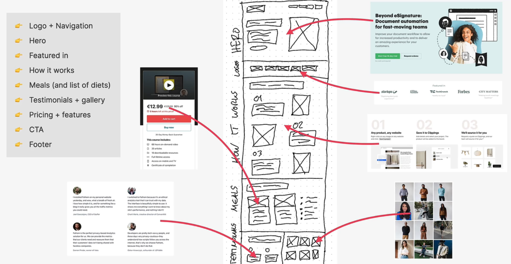

# 工具/资源

**免费素材网站**

背景：[unsplash](https://unsplash.com/)

人像：[UIfaces][https://www.uifaces.co/]

字体：[Google fonts](https://fonts.google.com/)

**前端设计**

亮色阴影色：[Tints and Shades](https://maketintsandshades.com/)

响应式网站：[Media Queries](https://mediaqueri.es/)

浏览器支持：[Can i use](https://caniuse.com/)

**插件**

VScode：

- Color Highlight 高亮颜色

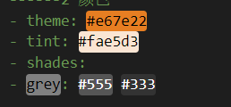

**第三方库**

style-resource：配置less全局变量

react-scroll：实现平滑滚动

**优化**

LightHouse

图像压缩：[Squoosh](https://squoosh.app/)

# CSS知识点

## flex和grid

### grid

``` less
.grid(@col, @align: unset) {
    display: grid;
    column-gap: 6.4rem;
    row-gap: 9.6rem;
    grid-template-columns: repeat(@col, 1fr);
    align-items: @align;

    &:not(:last-child) {
        margin-bottom: 9.6rem;
    }
}

.grid--col2 {
    .grid(2, center);
}
```

#### grid-template-columns

按比例分配宽度

``` css
grid-template-columns: repeat(3, 1fr)
grid-template-columns: 1fr 1fr 1fr
grid-template-columns: 3fr 2fr
```

#### 间距 gap

``` css
column-gap: 6.4rem;
row-gap: 9.6rem;
gap: 9.6rem;
```

#### grid-row/ grid-column

##### 顺序

强制显示在某一行

``` css
grid-row: 1;
```

##### 跨度

span 后面写跨几格，

场景：表格第一行分三列，第二行分两列

- 把grid声明为6列
- 第一行元素跨度2，第二行元素跨度3

``` css
.nav-grid{
    display: grid; 
    grid-template-columns: repeat(6, 1fr)
}

.nav-col {
    grid-column: span 2;
    grid-row: 1;
}

.addr-col {
    grid-column: span 3;
}
```

Html

``` html
<div>
    <div class=".addr-col"></div>
    <div class=".addr-col"></div>
    <div class=".nav-col"></div>
    <div class=".nav-col"></div>
    <div class=".nav-col"></div>
</div>
```

##### 居中

场景：grid里三个元素，列数为2，希望单独成行的那一个元素能居中

在单独成行的那个元素上设置css属性：

``` css
.element {
    grid-column: 1 / -1; // 表示选中该行所有元素
    justify-self: center;
}
```

### flex

#### 间距

也可以用gap，用法跟grid一样，但是有些浏览器不兼容

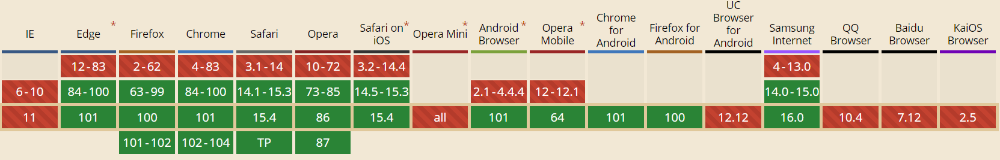

其他写法

``` css
.main-nav-list{
    display: flex;
}
.main-nav-list li:not(:last-child) {
    margin-right: 4.8rem;
}
```

# JS知识点

## 平滑滚动

实现平滑且可被浏览器兼容的滚动

使用场景：

点击导航栏连接，产生一个动画平滑地滚动到指定位置

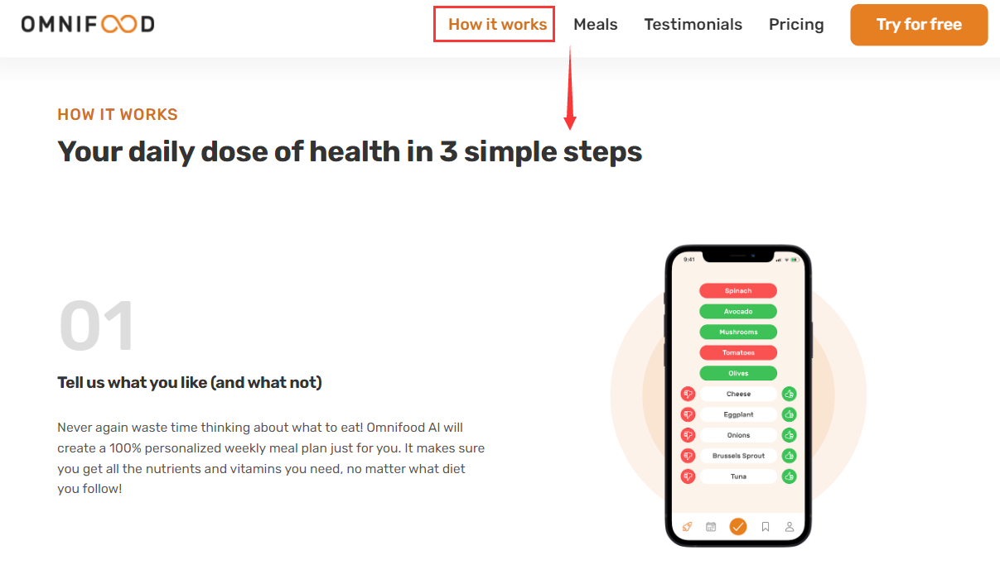

### 一般方式

导航栏中的按钮为a标签实现的超链接

``` html
<a href="#cta" class="btn btn--full margin-right-sm">Start eating well</a>
```

js脚本中选中所有`a: link`标签，手动绑定点击事件

- 阻止默认行为
- 获取每个a标签的href属性，得到转跳目标元素的id
- 获取目标元素，调用`scrollIntoView`方法，设置参数`behavior: "smooth"`，即可平滑滚动

但是该方法不适用于React的设计逻辑

``` js
const allLinks = document.querySelectorAll("a:link");

allLinks.forEach(function (link) {
  link.addEventListener("click", function (e) {
    e.preventDefault();
    const href = link.getAttribute("href");

    // Scroll back to top
    if (href === "#")
      window.scrollTo({
        top: 0,
        behavior: "smooth",
      });

    // Scroll to other links
    if (href !== "#" && href.startsWith("#")) {
      const sectionEl = document.querySelector(href);
      sectionEl.scrollIntoView({ behavior: "smooth" });
    }

    // Close mobile naviagtion
    if (link.classList.contains("main-nav-link"))
      headerEl.classList.toggle("nav-open");
  });
});
```

其他方式参考：[实现页面平滑滚动的N种姿势](https://juejin.cn/post/6898670533567578125)

### React-scroll

使用React插件[react-scroll](https://www.npmjs.com/package/react-scroll)

使用例：https://codesandbox.io/s/basic-6t84k

#### 常用API

``` js
import { Link, animateScroll as scroll} from 'react-scroll'
```

##### Link

| 参数        | 用例     | 含义                                                                            |
| ----------- | -------- | ------------------------------------------------------------------------------- |
| activeClass | 'active' | 判断滚动到指定的元素后，会在Link元素上加上一个css class，一般设类名为active     |
| to          | 'cta'    | 目标元素id或name                                                                |
| spy         | true     | 判断滚动到指定的元素后，使对应的Link元素变成选中状态（就是加上activeClass）     |
| hashSpy     | true     | 判断滚动到指定的元素后，在网页url后面显示哈希路径，例如 `localhost:3000/#meals` |
| smooth      | true     | 是否平滑                                                                        |
| offset      | -80      | 额外滚动距离，单位为px，传参时直接传数值                                        |
| duration    | 500      | 持续时间，单位为ms                                                              |

##### animateScroll as scroll

[源码](https://github.com/fisshy/react-scroll/blob/master/modules/mixins/animate-scroll.js)

options

``` js
{
  duration: 1500,
  delay: 100,
  smooth: true,
  containerId: 'ContainerElementID',
  offset: 50, // Scrolls to element + 50 pixels down the page
  ...
}
```

> Scroll To Top

```
scroll.scrollToTop(options);
```

> Scroll To Bottom

```
scroll.scrollToBottom(options);
```

> Scroll To (position)

```
scroll.scrollTo(100, options);
```

> Scroll To (Element)

```
scroll.scrollTo(element, options);
```

> Scroll More (px)

```
scroll.scrollMore(10, options);
```

#### 手写封装：NavLink

入参：

- className：给a标签加上class
- to：目标元素id
- onClick：除了转跳意外的点击事件处理函数
- props.children

``` jsx
import { Link, animateScroll as scroll } from 'react-scroll'

const NavLink = (props) => {
    return (
        // <a className='main-nav-link' href="#how">How it works</a>
        props.to !== "#"
            ?
            (<Link
                activeClass="active"
                className={props.className}
                to={props.to}
                smooth={true}
                duration={500}
                offset={-40}
                onClick={props.onClick}>
                {props.children}
            </Link>)
            :
            <a className={props.className}
                onClick={() => scroll.scrollToTop({ duration: 500 })}>
                {props.children}
            </a>
    )
}

export default NavLink
```

使用：

``` jsx
<NavLink className='main-nav-link' to="how" onClick={onCloseHandle}>How it works</NavLink>
```

#### 问题 ==todo==

spy和hashSpy会出现滚动到指定位置，但是判定激活的是上面的当前元素上面的那个元素，目前没有找到解决方案

参考：https://github.com/fisshy/react-scroll/issues/422

> I solved this by letting [react-waypoint](https://www.npmjs.com/package/react-waypoint) do the "set active" handling instead. So I removed `spy` and `onSetActive` from my `<Link>` elements and wrapped each targeted element with `<Waypoint>`. That way you get more control of when the target element is activated, and you can offset the triggers freely with using waypoints, while still keeping any scroll offset set in the `<Link>` element.

## 阻止滚动

场景：

产生弹窗或打开导航栏时，不希望下层的页面能够滚动，需要手动禁用


### 桌面端 ==todo==

粗暴的方法：html或body元素的overflow设为hidden（测试后是加在html元素上有效）

``` jsx
document.documentElement.style.overflow = 'hidden'
```

问题：

这样设置会影响子元素的overflow属性，造成页面布局抖动，不好

其他解决方案：[阻止滚轮滚动事件](https://juejin.cn/post/6869740995290857479#heading-3)

### 移动端

考虑兼容性的方法：touchmove事件，阻止默认行为

原理：参考 [js禁止页面滚动](https://www.cnblogs.com/wxcbg/p/10452985.html)

``` jsx
  const preventScroll = useCallback((e) => {
    e.preventDefault()
  }, [])
  useEffect(() => {
    if (isNavOpen) {

      document.documentElement.addEventListener(
        'touchmove',
        preventScroll,
        { passive: false }
      );  //passive 参数不能省略，用来兼容ios和android

    } else {

      document.documentElement.removeEventListener(
        'touchmove',
        preventScroll,
        { passive: false }
      );

    }
  }, [isNavOpen, preventScroll])
```

## IntersectionObserver

### API

文档：https://developer.mozilla.org/zh-CN/docs/Web/API/IntersectionObserver

`IntersectionObserver`**接口** (从属于[Intersection Observer API](https://developer.mozilla.org/en-US/docs/Web/API/Intersection_Observer_API)) 提供了一种异步观察目标元素与其祖先元素或顶级文档视窗([viewport](https://developer.mozilla.org/zh-CN/docs/Glossary/Viewport))交叉状态的方法。祖先元素与视窗([viewport](https://developer.mozilla.org/zh-CN/docs/Glossary/Viewport))被称为**根(root)。**

可以用于检测某一元素是否滚动到窗口内，或者在窗口类滚动到的比例

### 实例

以下使用场景：

- 检测某一元素是否滚动到视窗内

``` jsx
const Hero = () => {
  const heroRef = useRef(null);
  const scrollObserver = useCallback(
    node => {
      new IntersectionObserver(entries => {
        let en = entries[0]
        console.log(en.isIntersecting)
        if (!en.isIntersecting) {
          // 不相交，则sticky
          document.body.classList.add('sticky')

        } else {
          document.body.classList.remove('sticky')
        }

      }, {
        root: null,
        threshold: 0,
        rootMargin: '-80px',
      }).observe(node);
    },
    []
  );
  useEffect(() => {
    if (heroRef.current) {
      scrollObserver(heroRef.current);
    }
  }, [scrollObserver, heroRef]);

  return (
    <section ref={heroRef} className="section-hero">
      ...
    </section>
  )
}
```


# 响应式

## 桌面端优先vs移动端优先

目前更常用的是移动端优先，本项目采用桌面端优先

|          | 桌面端优先                               | 移动端优先                         |
| -------- | ---------------------------------------- | ---------------------------------- |
| 设计理念 | 先设计大屏幕的网页，然后逐步适配到小屏幕 | 先小再大                           |
| 实现方式 | 基于max-width                            | 基于min-width                      |
|          | `@media screen (max-width: 1200px)`      | `@media screen (min-width: 600px)` |

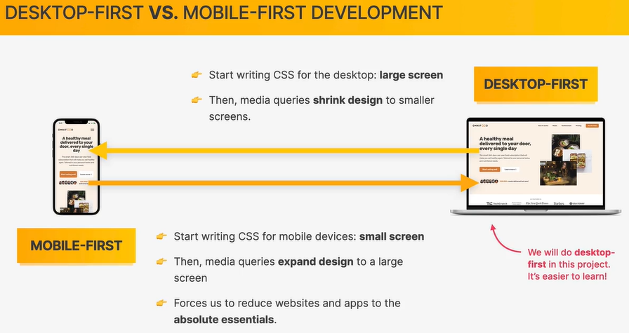

## rem

DOM根元素html中的字体大小，如果没有定义，则是浏览器默认字体大小：16px

```css
html{
    /* 
    效果：1rem = 10px 
    计算方法：默认为16px
    10/16 *100%=62.5%
    */
    font-size: 62.5%;
}
```

通过上面的转换，将html元素的字体大小转换为10px，即`1rem=10px`

可以把font-size, width, padding, margin之类的值都设置为以rem为单位，这样需要统一修改布局大小的时候（例如适配小屏幕）直接修改html元素的font-size就行

## 媒体查询

### @media

注意单位：rem & em

- 在media query中不是基于HTML元素的设置的
- 在这里固定 1rem=1em=16px
- 媒体查询中rem有问题，一般使用em

桌面端优先和移动端优先的差异：

- 桌面端优先，用max-width
- 移动端优先，用min-width

``` css
/* 1344px 较小pc */
@media screen and (max-width:84em) {
    .hero {
        max-width: 120rem;
    }
	// ...
}
```

只要满足要求，所有媒体查询都会生效，后定义的会覆盖前定义的，所以顺序很重要！

### breakpoint

一般断点可以认为是1200 900 600 300之类的

开发时可以直接用chrome调试断点，推荐Responsive模式

- 可以从大到小拉视窗，找到布局出现问题的大致宽度，然后在附近的位置加断点
- 一般一个媒体查询生效的范围差不多在200px左右，也就是两个端点之间差不多隔200px

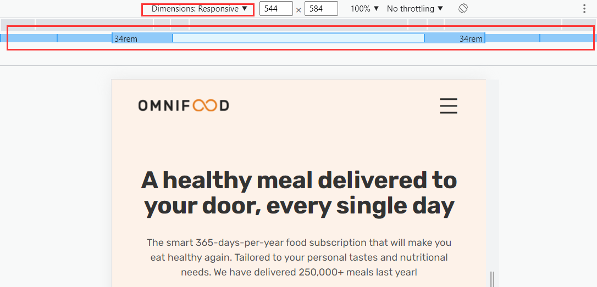

参考：

``` css
// 等于或大于 34*16 = 544px（手机横屏）
@media (min-width: 34em) { ... }

// 等于或大于 48*16 = 768px(平板竖屏)
@media (min-width: 48em) { ... }

// 等于或大于  62*16 = 992px（pc窄屏）
@media (min-width: 62em) { ... }

// 等于或大于 75*16 = 1200px（ pc宽屏）
@media (min-width: 75em) { ... }
```

## 技巧

### 折叠导航栏

场景：

视窗宽度较小时导航栏折叠起来，通过点击按钮展开


#### 实现思路

- 导航栏中的连接都包在一个flex容器里（`main-nav`）
- 媒体查询重写flex容器的样式（`flex-direction`, `gap`, `font-size`, ...）
- 给按钮绑定事件
  - 事件触发会给元素加上或删去css类（`nav-open`）
  - 在css类里控制导航栏的偏移 （`position: fixed`，注意父元素要`position: relative`）
    - 打开导航，则移入视窗 （`transform: translateX(0)`）
    - 关闭导航，则移出视窗 （`transform: translateX(100%)`）
    - 设置渐入渐隐效果
      - 动画：`transition: all 0.5s ease-in`
      - 透明度：`opacity: 0/1`
      - 事件触发：`pointer-events: none/auto`
      - 不被屏幕阅读器识别：`visibility: hidden/visible`

#### 代码

``` jsx
const Header = () => {
  const [isNavOpen, setIsNavOpen] = useState(false)

  function onClickHandle(e) {
    setIsNavOpen(!isNavOpen)
  }

  function onCloseHandle(e) {
    setIsNavOpen(false)
  }

  return (
    <header className={'header ' + (isNavOpen ? 'nav-open ' : '')}>
      <NavLink to="#">
        
      </NavLink>
      <nav className='main-nav'>
        <ul className='main-nav-list'>
          <li><NavLink className='main-nav-link' to="how" onClick={onCloseHandle}>How it works</NavLink></li>
          <li><NavLink className='main-nav-link' to="meals" onClick={onCloseHandle}>Meals</NavLink></li>
          <li><NavLink className='main-nav-link' to="testimonials" onClick={onCloseHandle}>Testimonials</NavLink></li>
          <li><NavLink className='main-nav-link' to="pricing" onClick={onCloseHandle}>Pricing</NavLink></li>
          <li><NavLink className='main-nav-link nav-cta' to="cta" onClick={onCloseHandle}>Try for free</NavLink></li>
        </ul>
      </nav>

      <button className='btn-mobile-nav' aria-label='open navigation' onClick={onClickHandle}>
        <i className='icon-mobile-nav iconfont icon-menu'
          name="btn-menu"></i>
        <i className='icon-mobile-nav iconfont icon-close'
          name="btn-close"></i>
      </button>
    </header>
  )
}
```

CSS

``` css
@media screen and (max-width:59em) {
    .main-nav {
        position: fixed;
        background-color: rgba(255, 255, 255, 0.9);
        -webkit-backdrop-filter: blur(10px);
        backdrop-filter: blur(10px);
        top: 0;
        left: 0;
        width: 100%;
        height: 100vh;
        transform: translateX(100%);
        z-index: 10;

        display: flex;
        align-items: center;
        justify-content: center;

        transition: all 0.5s ease-in;
        // 1. 透明度改为0
        opacity: 0;
        // 2. 取消事件触发
        pointer-events: none;
        // 3. 对屏幕阅读器不可见
        visibility: hidden;

    }

    .nav-open {

        .main-nav {
            opacity: 1;
            pointer-events: auto;
            visibility: visible;
            transform: translateX(0);
        }

        .icon-mobile-nav {

            &[name="btn-close"] {
                display: block;
            }

            &[name="btn-menu"] {
                display: none;
            }
        }
    }
}
```

### 粘性导航栏

场景：

滚动到顶部时，导航栏在标准流中，滚动到一定位置时，导航栏脱标固定在顶端

#### 实现思路

- 给**body元素**添加css类 `sticky`
- 滚动到顶部时，移除 `sticky` 类，否则，加上 `sticky` 类
  - 事件应该写在导航栏元素之后的第一个元素（`section-hero`）
- 修改元素的样式，使用嵌套选择器 `.sticky .xxx`，这样就能使sticky元素影响所有的元素
  - 导航栏的样式要修改
    - `position: fixed`
  - 导航栏以后第一个元素要（`section-hero`）加上 `margin-top` 
    - 值等于导航栏的高度（为了视觉上没有高度抖动）

#### 代码

**方案1**：IntersectionObserver

参考 [IntersectionObserver](#IntersectionObserver)，这个方案丑，放弃了

**方案2**：scrollTop

判断scrollTop是不是等于0

JS

``` jsx
const Hero = () => {
  const [isTop, setIsTop] = useState(true)

  useEffect(() => {
    function scrollHandle() {
      const scrollTop = document.documentElement.scrollTop || document.body.scrollTop;
      // console.log(scrollTop)
      if (scrollTop === 0) {
        setIsTop(true)
      } else {
        setIsTop(false)
      }
    }
    window.addEventListener('scroll', scrollHandle)
    return () => {
      window.removeEventListener('scroll', scrollHandle)
    }

  }, [])

  useEffect(() => {
    if (isTop) {
      document.body.classList.remove('sticky')
    } else {
      document.body.classList.add('sticky')
    }
  }, [isTop])
  // ...
}
```

CSS

``` less
.sticky {
    .header {
        position: fixed;
        width: 100%;
        top: 0;
        bottom: 0;
        height: 8rem;
        padding-top: 0;
        padding-bottom: 0;
        z-index: 9;
        background-color: rgba(255, 255, 255, 0.95);
        box-shadow: 0 1.2rem 3.2rem rgba(0, 0, 0, 0.05);

    }

    .section-hero {
        margin-top: 8rem;
    }
}
```


# 优化&兼容性

## LightHouse

chrome自带的性能评估工具

- 可以选择设备，评估类型，根据报告修改

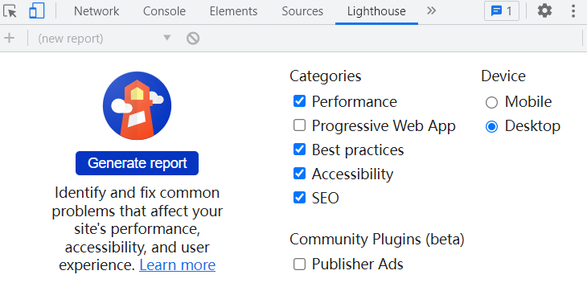

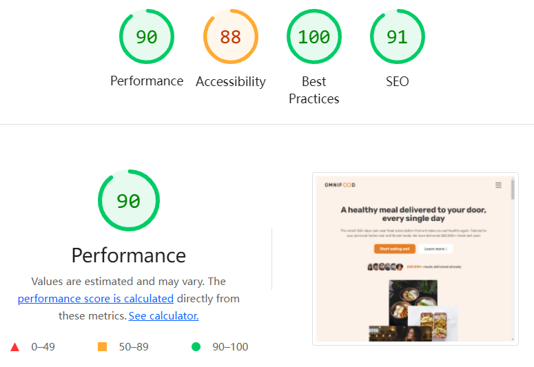

### 性能 Performance

#### Properly size images

> Serve images that are appropriately-sized to save cellular data and improve load time. [Learn more](https://web.dev/uses-responsive-images/?utm_source=lighthouse&utm_medium=devtools).

修改图片大小，小窗口不需要大图片

**解决方案：**考虑用 [srcset](#srcset)

#### Serve images in next-gen formats

> Image formats like WebP and AVIF often provide better compression than PNG or JPEG, which means faster downloads and less data consumption. [Learn more](https://web.dev/uses-webp-images/?utm_source=lighthouse&utm_medium=devtools).

**解决方案：**图片推荐使用**webp格式**，参考 [webp](#webp)

#### Eliminate render-blocking resources

> Resources are blocking the first paint of your page. Consider delivering critical JS/CSS inline and deferring all non-critical JS/styles. [Learn more](https://web.dev/render-blocking-resources/?utm_source=lighthouse&utm_medium=devtools).

引入外部的字体和iconfont会这样

**解决方案：**todo

#### Ensure text remains visible during webfont load

> Leverage the font-display CSS feature to ensure text is user-visible while webfonts are loading. [Learn more](https://web.dev/font-display/?utm_source=lighthouse&utm_medium=devtools).

引入外部字体和iconfont时会产生这个问题，字体加载会导致文字闪烁

**解决方案：**todo

#### Image elements do not have explicit `width` and `height`

> Set an explicit width and height on image elements to reduce layout shifts and improve CLS. [Learn more](https://web.dev/optimize-cls/?utm_source=lighthouse&utm_medium=devtools#images-without-dimensions)

图片没有明确宽高，下载完图片之前浏览器没法知道图片的宽高，会导致布局闪烁

**解决方案：**

定义img标签时先自带宽高，尽量写得和真实图片一致

``` html

```

在css中，通常是设置宽度100%，这里需要加上高度自动

``` css
.meal-img {
    width: 100%;
    height: auto;
}
```

## favicon

react项目中的public目录下

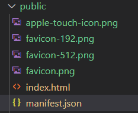

在index.html中设置favicon，不同的端有不同的设置

**桌面端**

需要对应图片分辨率为64x64

``` html
<link rel="icon" href="%PUBLIC_URL%/favicon.png" />
```

**ios**

需要对应图片分辨率为180x180

``` html
<link rel="apple-touch-icon" href="%PUBLIC_URL%/apple-touch-icon.png" />
```

**android**

需要两种图片尺寸192x192，512x512

``` html
<link rel="manifest" href="%PUBLIC_URL%/manifest.json" />
```

需要在同目录下的manifest.json文件中配置图片路径

``` js
{
  "short_name": "Omnifood",
  "name": "Omnifood | Never cook again!",
  "icons": [
    {
      "src": "favicon.png",
      "sizes": "64x64 32x32 24x24 16x16",
      "type": "image/x-icon"
    },
    {
      "src": "favicon-192.png",
      "type": "image/png",
      "sizes": "192x192"
    },
    {
      "src": "favicon-512.png",
      "type": "image/png",
      "sizes": "512x512"
    }
  ],
  "start_url": ".",
  "display": "standalone",
  "theme_color": "#e67e22",
  "background_color": "#fdf2e9"
}
```

## 图片

查看Network，可以观察到传输了4.1MB的数据，其中大部分是图片，需要对图片进行压缩


### 图片尺寸

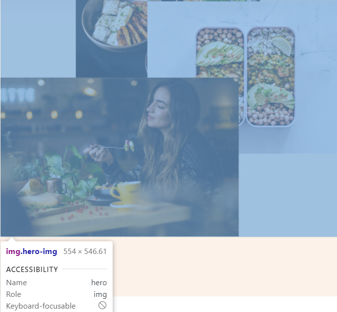

通常来说是这样判断，以上图为例：

- 一开始有一张很大的图片
- 在浏览器里检查图片能够显示的最大宽度（554）
- 对这个数值四舍五入后×2（600×2=1200），以适应二倍屏的手机

### webp

使用Google的在线图像压缩工具：[Squoosh](https://squoosh.app/)

目前最优的图片格式为webp，可以不断调整找到最佳压缩比

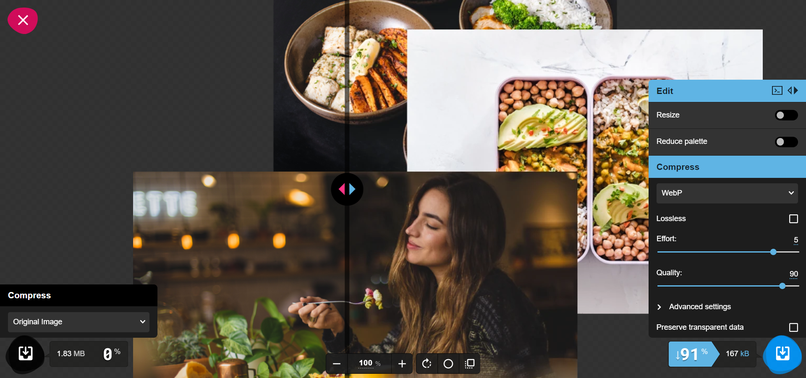

### ==srcset==

webp不能在所有浏览器上支持 https://caniuse.com/?search=webp

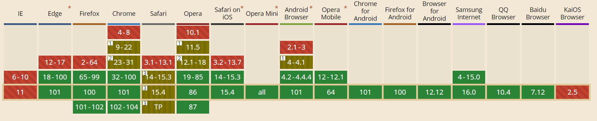

所以可以使用`srcset`做兼容

``` jsx
<picture>
    <source srcSet={HeroImgWebp} type="image/webp" />
    <source srcSet={HeroImg} type="image/png" />
    
</picture>
```

解读：

- 用picture标签包裹住img标签
- source标签声明可以使用的源和类型
- img标签中的src属性赋值为想要默认显示的图片，这里设置为webp格式的源
- 浏览器会根据自己支持的源请求图片

# netlify部署

使用[netlify](https://www.netlify.com/)部署React项目

参考：

直接部署构建好的静态文件：[【React】技巧之用netlify云服务部署react应用](https://blog.csdn.net/qq_38586850/article/details/83246606)

创建项目同时部署：[How to deploy React Apps in less than 30 Seconds](https://www.netlify.com/blog/2016/07/22/deploy-react-apps-in-less-than-30-seconds/)

## 直接部署静态资源

下面的方法的适用场景为：

- 本地已经build构建好静态资源

1）构建

```sh
npm run build
```

2）部署

注册登录netlify

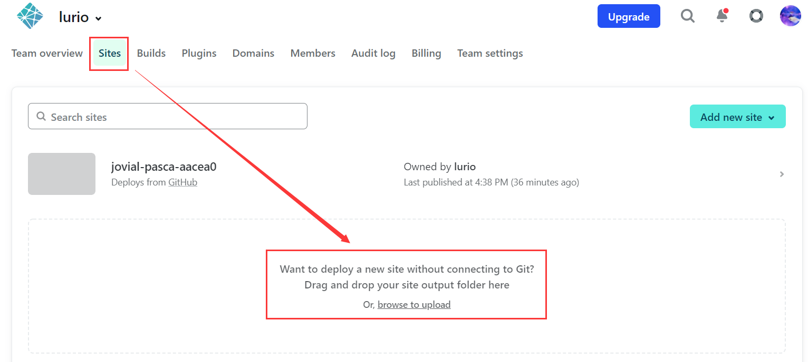

直接把上一步生成的build目录上传就能完成部署

## git部署

下面的方法的适用场景为：

- 本地仓库已经关联到github远程仓库
- 每次分支推送自动更新并重新部署

1）创建git仓库并上传项目

2）部署

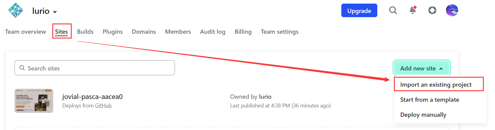

github授权后选择要部署的仓库

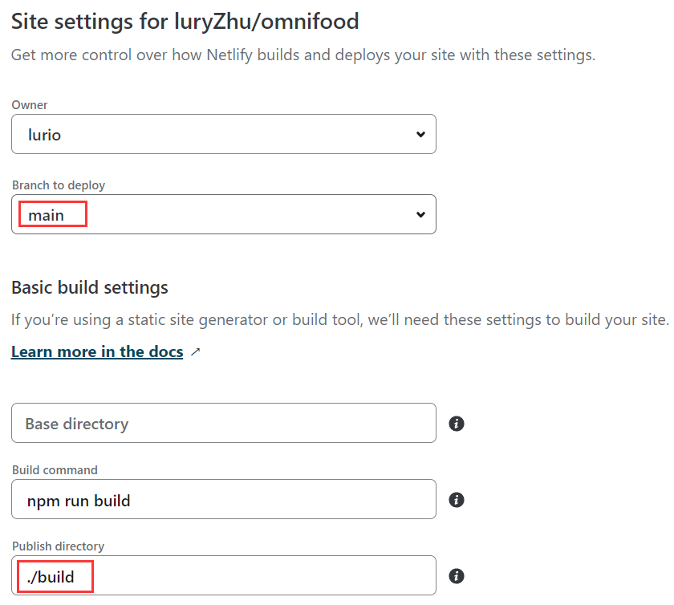

注意配置：其他默认即可

- 选择要部署的分支
- 路径改成`./build`

### 问题

部署失败，可以点击log查看原因

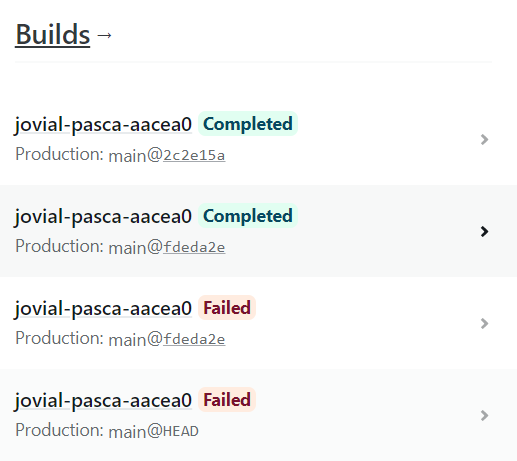

#### build失败

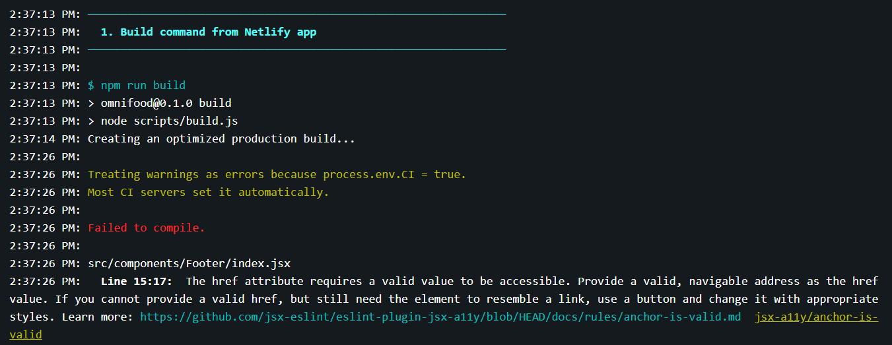

本地可以成功构建，但是在netlify上失败，报错

> Treating warnings as errors because process.env.CI = true.
> Most CI servers set it automatically.

本质原因是，jenkins使用ESLint代码检查构建时会自动将warn转成成错误

**解决方案：**

1. 解决掉ESLint的警告

2. [参考](https://dev.to/kapi1/solved-treating-warnings-as-errors-because-of-process-env-ci-true-bk5) CI设置为false，把netlify的构建指令修改为 `CI=false npm run build`

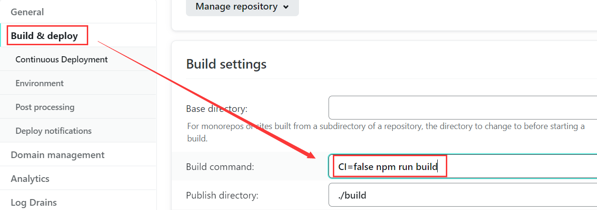

#### deploy失败

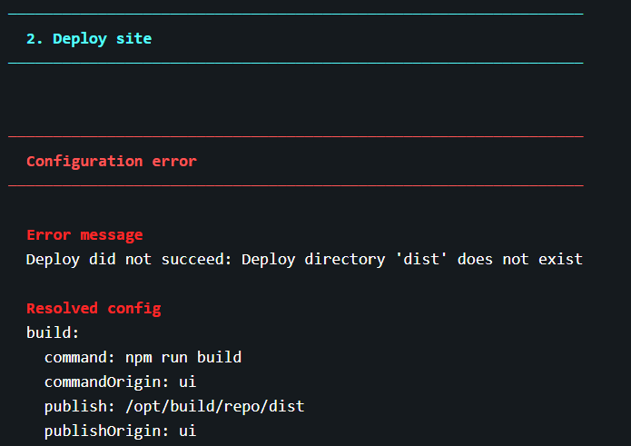

找不到deploy目录

原因是配置时没有改部署目录

**解决方案：**

在setting里面改成`./build`即可

